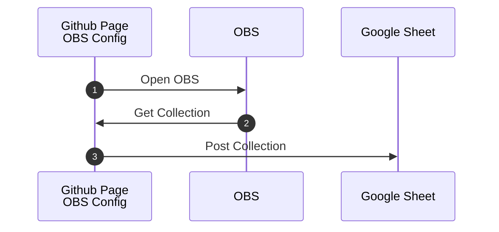
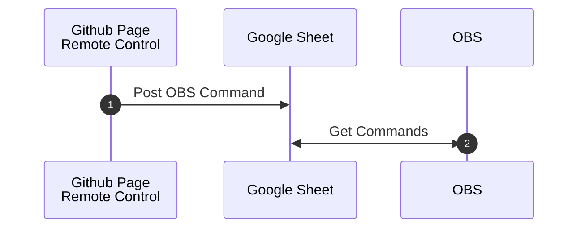

# Collection Remote Control

Change Scenes or toggle Sources and Filters remotely via a webpage.    

## Step 0: Setup Google Sheet

Copy this Google Sheets 

>[Remote Control Collection](https://docs.google.com/spreadsheets/d/1KTHWZehYhwRoK9UJEKUN4DM56qAN1Xw3QTCdkWP_pVs/copy)

### Share the sheet

  General Access "Anyone with the Link" | Viewer

### Deploy the AppsScript

Open Apps Script Editor
    
- from the file menu select, Extensions -> Apps Script 
  - In the Apps Script Editor, click the "Deploy" button > New Deployment
  - Set 
    - 'Execute as' = Me
    - 'Who has access' = Anyone
  - Deploy

### Authorize access
Apps Scripts need to be authorized for use. 
  - Click 'Authorize Access'
  
  - Click 'Advanced'
  
  - Click 'Go To ...'
  
  - Click 'Allow'
  
  - Click 'Copy'
  
     

## Step 1: Configure OBS

Add a Browser Source 
- set the URL
  ```
  https://uuoocl.github.io/Collection_Remote_Control/collectionControl.html?sheetID={yourSheetID}&gasID={your Google Apps Script Deployment ID}
  ```
- Open a Windowed Projector(Source)
  - right click on the Browser Source
  

Configure the OBS WebSocket Server.  The WebSocket Server can be configured using the 
[configuration page](https://uuoocl.github.io/Collection_Remote_Control/) 
in this repository or through the OBS user interface. 

In the 
[configuration page](https://uuoocl.github.io/Collection_Remote_Control/) 
paste the Google Apps Script Deployment ID, copied from step 0. Then press the "Connect" button.


**Configuration sequence diagram:**


## Step 2: Remote Control OBS

Open the [configuration page](https://uuoocl.github.io/Collection_Remote_Control/), click the "copy Link" button for the Browser Source created in step 1. This page can send messages to the Google Sheet created in step 0.  

OBS will respond to the instructions posted to the Google Sheet. 

In the Remote Control page, click in the "visibility" column to set the Scene, Source, or Filter. 


**Remote control sequence diagram:**


