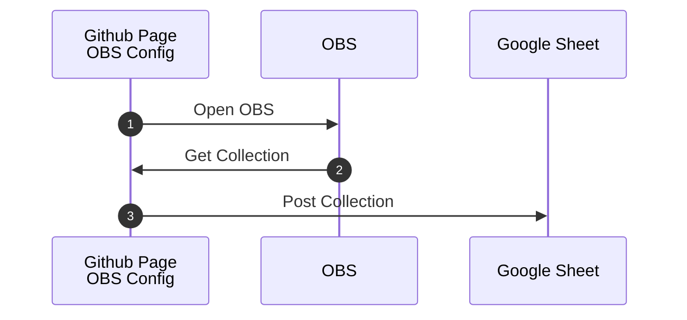
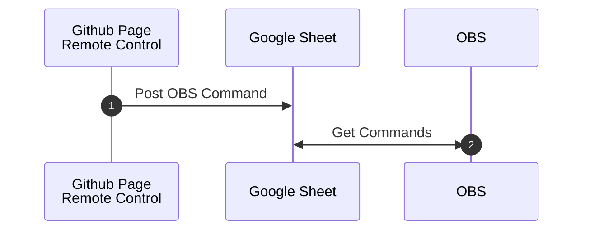

# Collection Remote Control

Change Scenes or toggle Sources and Filters remotely via a webpage.    

## Step 0: Setup Google Sheet

Copy this Google Sheets 

>[Remote Control Collection](https://docs.google.com/spreadsheets/d/1zlZLGXVOu_cS6gaZNq4Bd-XKEPBEz3tYZheYGJnBFyU/copy)

### Share the sheet

- Set the General Access to "Anyone with the Link" can view

- Enter the Sheet ID in the [Collection Remote Control Configuration Page](https://uuoocl.github.io/Collection_Remote_Control/) 

### Deploy the AppsScript

Open Apps Script Editor
    
- from the file menu select, Extensions -> Apps Script 
  - In the Apps Script Editor, click the "Deploy" button > New Deployment
  - Set 
    - 'Execute as' = Me
    - 'Who has access' = Anyone
  - Deploy

### Authorize access
Apps Scripts need to be authorized for use. 
  - Click 'Authorize Access'
    - 

  - Click 'Advanced'
    - 
  
  - Click 'Go To ...'
    - 
  
  - Click 'Allow'
    - 
  
  - Click 'Copy'
    - 
     
Enter the Sheet ID in the [Collection Remote Control Configuration Page](https://uuoocl.github.io/Collection_Remote_Control/) 

## Step 1: Configure OBS

Open the [configuration page](https://uuoocl.github.io/Collection_Remote_Control/). 

In the "Collection Remote Control Links" section, click the "copy Link" button for the OBS Browser Source. 

### Add an OBS Browser Source 
- set the OBS Browser Source URL by pasting the Collection Remote Control link.

### Open a Windowed Projector(Source)
  - right click on the Browser Source
    - 

### Configure the OBS WebSocket Server.

The WebSocket Server can be configured using the 
[configuration page](https://uuoocl.github.io/Collection_Remote_Control/) 
in this repository or through the OBS user interface. 

## Step 2: Post the OBS Collection to Google Sheets 

In the 
[configuration page](https://uuoocl.github.io/Collection_Remote_Control/) 
 press the "Connect" button.

**Configuration sequence diagram:**

## Step 3: Remote Control OBS

Open the [configuration page](https://uuoocl.github.io/Collection_Remote_Control/), click the "copy Link" button for the Collection Remote Control Link

Paste the Collection Remote Control link in a browser. 

In the Remote Control page, click in the "visibility" column to set the Scene, Source, or Filter. 

OBS will respond to the instructions posted to the Google Sheet. 

**Remote control sequence diagram:**
